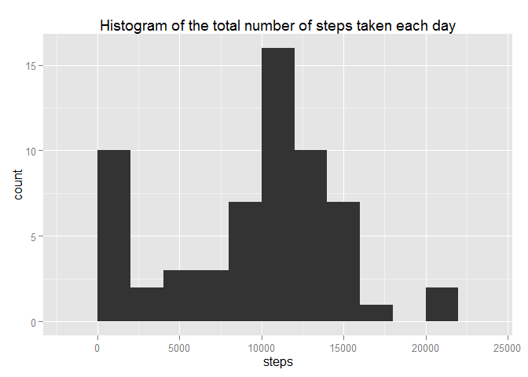
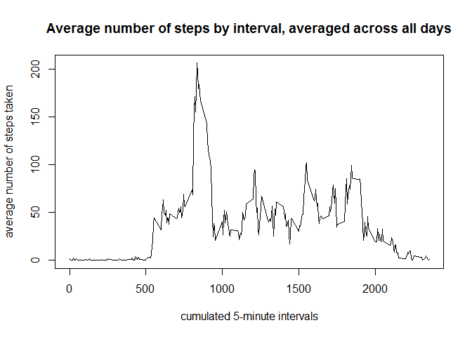
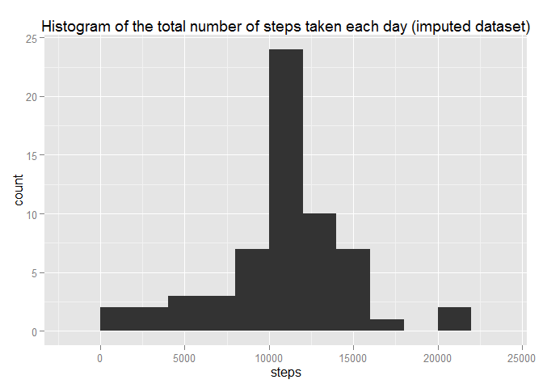

# Reproducible Research: Peer Assessment 1


## Loading and preprocessing the data


```r
# clean up the environment
rm(list=ls()) 

# load the libraries
library(knitr)
library(ggplot2)
library(lattice)

# unzip and prepare the dataset folder
zipName <- "activity.zip"

fileName <- "dataset/activity.csv" 
if (!file.exists(fileName)) { 
    unzip(zipName, exdir = "dataset") 
}

# read the data
activity.data <- read.csv(fileName, na.strings = "NA")
```

## What is mean total number of steps taken per day?

```r
# aggregate steps data by date
activity.data.agg <- aggregate(x = activity.data$steps,
                               by = list(activity.data$date),
                               FUN = sum,
                               na.rm = TRUE)
names(activity.data.agg) <- c("date", "steps")
```


```r
# make a histogram of the total number of steps taken each day
ggplot(activity.data.agg, aes(x=steps)) + 
    geom_histogram(binwidth=2000) +
    ggtitle("Histogram of the total number of steps taken each day")
```

 


```r
# get the mean of total number of steps taken per day
mean(activity.data.agg$steps, na.rm = TRUE)
```

```
## [1] 9354.23
```


```r
# get the median of total number of steps taken per day
median(activity.data.agg$steps, na.rm = TRUE)
```

```
## [1] 10395
```
## What is the average daily activity pattern?


```r
# aggregate steps data by interval
activity.data.agg.int <- aggregate(x = list(steps = activity.data$steps),
                               by = list(
                                   interval = activity.data$interval),
                               FUN = mean,
                               na.rm = TRUE)

# plot the time series
plot(activity.data.agg.int$steps ~ activity.data.agg.int$interval, 
     type = "l",
     main = "Average number of steps by interval, averaged across all days",
     xlab = "cumulated 5-minute intervals",
     ylab = "average number of steps taken")
```

 


```r
# get the 5-minute interval that, on average across all the days in the dataset,
# contains the maximum number of steps
activity.data.agg.int[which.max(activity.data.agg.int$steps),]
```

```
##     interval    steps
## 104      835 206.1698
```

## Imputing missing values

```r
# get the total number of missing values in the dataset
sum(!complete.cases(activity.data))
```

```
## [1] 2304
```


```r
# create a new dataset
activity.data.fill <- activity.data

# add a new column with the mean values per interval and recycle
activity.data.fill$steps.avg <- activity.data.agg.int$steps

#  fill in all of the missing values in the dataset using the mean per interval
na.values <- is.na(activity.data.fill$steps)
activity.data.fill$steps[na.values] <- activity.data.fill$steps.avg[na.values]

# aggregate those data 
activity.data.fill.agg <- aggregate(list(steps = activity.data.fill$steps),
                               by = list(date = activity.data.fill$date),
                               FUN = sum
                               )
```


```r
# make a new histogram of the total number of steps taken each day
# with the new imputed dataset
ggplot(activity.data.fill.agg, aes(x=steps)) + 
    geom_histogram(binwidth=2000) +
    ggtitle("Histogram of the total number of steps taken each day (imputed dataset)")
```

 


```r
# get the mean of total number of steps taken per day (imputed dataset)
mean(activity.data.fill.agg$steps, na.rm = TRUE)
```

```
## [1] 10766.19
```


```r
# get the median of total number of steps taken per day (imputed dataset)
median(activity.data.fill.agg$steps, na.rm = TRUE)
```

```
## [1] 10766.19
```
## Are there differences in activity patterns between weekdays and weekends?


```r
# set the time system to English Language
Sys.setlocale("LC_TIME", "English")
```

```
## [1] "English_United States.1252"
```

```r
# create a factor variable to discriminate between WDs and WEs
activity.data.fill$days <- as.factor(ifelse(weekdays(as.Date(activity.data.fill$date)) %in% c("Saturday","Sunday"), "Weekend", "Weekday"))

activity.data.fill.agg.wds <- aggregate(list(steps =              
                                                 activity.data.fill$steps),
                               by = list(interval =
                                             activity.data.fill$interval,
                                         days = activity.data.fill$days
                                        ),
                               FUN = mean
                               )

# make a xyplot using the lattice package
xyplot(steps ~ interval | days, 
       activity.data.fill.agg.wds, 
       layout = c(1, 2),
       type = "l")
```

 
